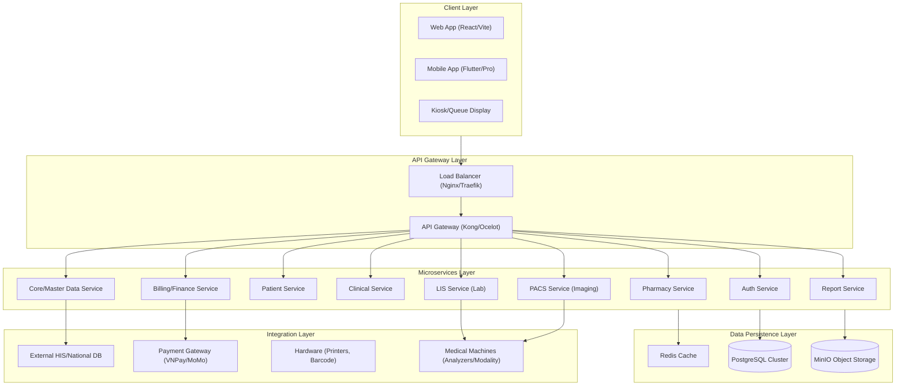
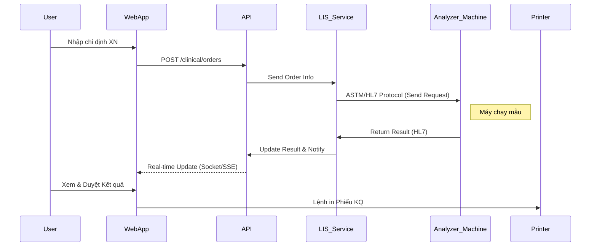

# Kiến trúc Hệ thống (System Architecture)

Tài liệu này mô tả chi tiết kiến trúc kỹ thuật của hệ thống NextGen Digital Health Platform (DHP), bao gồm các tầng Database, Microservices, Frontend và các thành phần tích hợp.

## 1. Kiến trúc Tổng quan (High-Level Architecture)

Mô hình kiến trúc tổng thể của NextGen DHP được xây dựng theo hướng **Microservices**, đảm bảo tính mở rộng (scalability), độc lập (decoupling) và dễ dàng bảo trì.

## 2. Chi tiết các Thành phần

### 2.1. Frontend Layer
*   **Web Application (NextGen Web):**
    *   **Công nghệ:** React 18, Vite, TypeScript.
    *   **UI Framework:** Shadcn UI, Tailwind CSS.
    *   **State Management:** TanStack Query (React Query) + Zustand.
    *   **Ứng dụng:** Dành cho Bác sĩ, Điều dưỡng, Lễ tân, Dược sĩ, Thu ngân, Admin.
*   **Mobile Application (NextGen Mobile):**
    *   **Công nghệ:** Flutter (Hoặc React Native tùy phase sau).
    *   **Ứng dụng:** Dành cho Bệnh nhân (Book lịch, Xem hồ sơ) và Quản lý (Xem báo cáo).

### 2.2. API Gateway & Security
*   **API Gateway:** Đóng vai trò là cửa ngõ duy nhất (Entry point) cho mọi request từ Client. Xử lý Routing, Rate Limiting, CORS.
*   **Authentication & Authorization:**
    *   Sử dụng **OAuth2 / OpenID Connect**.
    *   **Auth Service:** Phát hành JWT Token (Access Token & Refresh Token).
    *   Cơ chế phân quyền RBAC (Role-Based Access Control) chi tiết đến từng action (View, Create, Edit, Delete).

### 2.3. Microservices Layer (Backend)
Hệ thống được chia nhỏ thành các Service chuyên biệt (Domain-Driven Design):

1.  **Auth Service:** Quản lý User, Role, Permission, Auth Log.
2.  **Core Service:** Quản lý Danh mục dùng chung (ICD-10, Hành chính, Phòng ban), Cấu hình hệ thống.
3.  **Patient Service:** Quản lý hồ sơ bệnh nhân (MPI), Lịch sử khám.
4.  **Clinical Service:** Tiếp nhận, Khám bệnh, Kê đơn, Chỉ định CLS, Hồ sơ bệnh án điện tử (EMR).
5.  **LIS Service (Laboratory):** Kết nối máy xét nghiệm (ASTM/HL7), Quản lý quy trình và trả kết quả xét nghiệm.
6.  **PACS Service (Imaging):** Kết nối máy CĐHA (DICOM), Lưu trữ và xử lý hình ảnh (X-Quang, Siêu âm, MRI).
7.  **Pharmacy Service:** Quản lý Kho dược, Xuất/Nhập tồn, Cấp phát thuốc.
8.  **Billing Service:** Quản lý Bảng giá, Tính tiền, BHYT, Thu ngân, Hóa đơn điện tử.
9.  **Report Service:** Job tổng hợp dữ liệu (ETL), Xuất báo cáo động, Dashboard.

### 2.4. Data Layer (Cơ sở dữ liệu)
*   **Database:** PostgreSQL (Khuyến nghị cho dữ liệu y tế cần độ tin cậy cao, ACID transaction).
    *   Mỗi Microservice có thể sở hữu Schema riêng hoặc Database riêng (Database per Service pattern).
*   **Cache:** Redis dùng để cache danh mục, session user, hàng đợi (Queue).
*   **Storage:** MinIO (S3 Compatible) lưu trữ file ảnh (X-Ray, MRI), PDF tài liệu, Avatar.

## 3. Kiến trúc Tích hợp (Integration Architecture)

*   **LIS/PACS Integration:** Sử dụng chuẩn HL7/DICOM để giao tiếp với hệ thống máy y tế.
*   **Payment Gateway:** Tích hợp API cung cấp dịch vụ thanh toán QR Code (VietQR) hoặc ví điện tử.
*   **National Database:** Đồng bộ dữ liệu lên cổng BHXH, cổng Dược Quốc gia (theo chuẩn XML/API của Bộ Y tế).

## 4. Mô hình Triển khai (Deployment Model)

*   **Containerization:** Sử dụng Docker để đóng gói các Service.
*   **Orchestration:** Kubernetes (K8s) hoặc Docker Swarm để quản lý, scale container.
*   **CI/CD:** GitHub Actions / GitLab CI để tự động build, test và deploy.

---
**Ghi chú:** Kiến trúc này được thiết kế để đảm bảo đáp ứng được nhu cầu của Milestone 1 (Phòng khám) và sẵn sàng mở rộng cho Bệnh viện (Phase sau).
